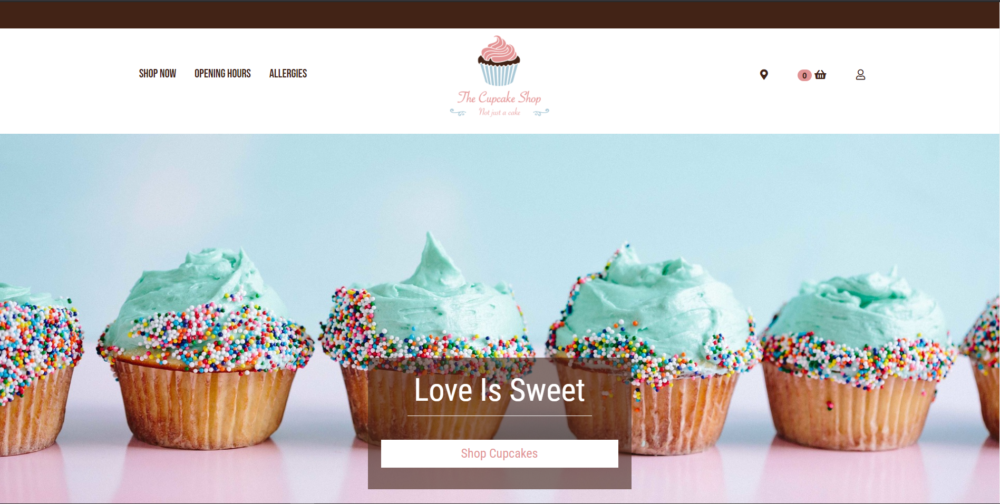

# The Cupcake Shop

This is an academic exercise to complete the requirements of the Lexicon programming training in Stockholm. All materials are not used for commercial purposes and by no means represent any commercial activity from the developers’ part. The project duration was two weeks during which we were to create an ASP.NET web application for a web shop using the MVC design pattern, with given functionality requirements (not stated here in README).

Check the Documentation file for more information and images of this website.

### Developers

- Anette Kniberg
- Dimitri Pirogov
- Rémy Ghalayini

## Concept

Our customer wishes to start a new e-commerce website to increase its sales. The customer is bakery selling cupcakes. The website must show all the products that the owner wishes to sell, and it should allow customers to select and buy products. The owner should be able to easily add, edit and remove products from the website.

#### Additional information

- This ASP.NET web application built using .NET Framework version 4.6.1
- SQL Server 2019 Express was used for data integration and management
- Adobe XD to build the framework and design the website prior to coding
- Adobe Illustrator to design the logo
- Git for version control, using Github to exchange code between the team members
- Trello.com for hosting Scrum-boards ([link](https://trello.com/ "link"))
- Microsoft teams for daily virtual standup-meetings, file exchange, and overall communication between the team members.

The product images are stored in the local database. Therefore, no images will be displayed if this repository has been pulled or forked and the user should populate the database by their own product images.

Additional functionalities are needed in this project and will be added in the future.
